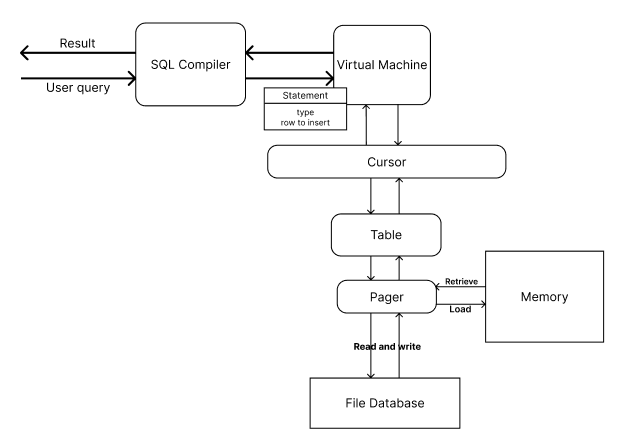

# MyDatabase: Simple SQL Database Implementation

This project is an implementation of a simple SQL database, designed to simulate core functionalities of a relational database management system. The database system is built in C, inspired by the SQLite architecture, and provides basic operations such as inserting, selecting, and validating data with error handling for common issues like negative IDs or overly long strings.

The architecture of the solution follows a modular design, where each functionality is neatly separated to allow for easy extensibility. Below is a diagram illustrating the architecture of the database system:

This project serves as a foundational implementation for understanding how SQL databases operate at a low level and provides a basis for future enhancements, including advanced features like indexing, table deletion, and more complex query operations.
